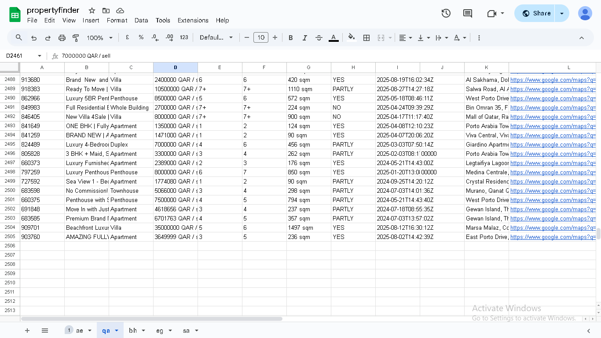

# 🏠 Property Finder Scraper

[](https://docs.google.com/spreadsheets/d/1Ch8FTlwN_bYMZHVGRLDpee7wyMHV1FoWpo3qewoewYc)

A Python-based web scraper for extracting real estate listings from **Property Finder** across multiple countries.  
The scraper supports both **synchronous (requests)** and **asynchronous (httpx + asyncio)** modes and automatically uploads results to **Google Sheets**.

---

## 📂 Project Structure

```
.env                  # Environment variables (Google Sheet ID, Scraper API key, etc.)
credentials.json      # Google Service Account credentials for Google Sheets API
google_sheet.py       # Google Sheets integration (uploading scraped data)
main_asyncio.py       # Asynchronous scraper (fast, concurrent scraping)
main.py               # Synchronous scraper (simpler, reliable)
requestmask.py        # Random headers & ScraperAPI integration
requirements.txt      # Python dependencies
settings.py           # Project settings (environment config loader)
README.md             # ...
```

---

## ✨ Features

- Scrapes property listings (buy, rent, commercial, projects) from Property Finder.
- Supports multiple countries:  
  🇦🇪 UAE, 🇶🇦 Qatar, 🇧🇭 Bahrain, 🇪🇬 Egypt, 🇸🇦 Saudi Arabia.
- Extracts rich property details:
  - Title, Type, Price, Bedrooms, Bathrooms, Size
  - Furnishing status
  - Location + Google Maps link
  - Agent/Broker details
  - Listing & image URLs
  - Short description
- Uploads structured results to **Google Sheets**.
- **Request masking** with random User-Agents & optional ScraperAPI.
- Two scraping modes:
  - **Sync** (`main.py`) → stable, simple
  - **Async** (`main_asyncio.py`) → fast, concurrent

---

## 📊 Demo / Example Output

You can view a live example of scraped data here:  
👉 [Google Sheet Example](https://docs.google.com/spreadsheets/d/1Ch8FTlwN_bYMZHVGRLDpee7wyMHV1FoWpo3qewoewYc)

---

## ⚙️ Installation

1. **Clone the repository**
   ```bash
   git clone https://github.com/your-username/property-finder-scraper.git
   cd property-finder-scraper
   ```

2. **Create a virtual environment & activate**
   ```bash
   python -m venv venv
   source venv/bin/activate   # Linux / macOS
   venv\Scripts\activate      # Windows
   ```

3. **Install dependencies**
   ```bash
   pip install -r requirements.txt
   ```

---

## 🔑 Setup

### 1. Google Sheets API
- Enable Google Sheets API & Google Drive API in Google Cloud Console.
- Create a **Service Account** and download `credentials.json`.
- Share your Google Sheet with the service account email.

### 2. Environment Variables
Create a `.env` file:

```env
GOOGLE_SHEET_ID=your_google_sheet_id_here
SCRAPER_API_KEY=your_scraperapi_key_here   # optional
```

### 3. Settings
To enable ScraperAPI, set in `settings.py`:
```python
USE_SCRAPER_API = True
```

---

## ▶️ Usage

Run synchronous scraper:
```bash
python main.py
```

Run asynchronous scraper:
```bash
python main_asyncio.py
```

---

## ⚠️ Disclaimer
This project is for **educational purposes only**.  
Scraping Property Finder or similar sites may violate their **Terms of Service**.  
Use responsibly.

---

## 👨‍💻 Author
Developed by **eyobjjj**  
Freelance Python Developer specializing in Web Scraping & Automation
